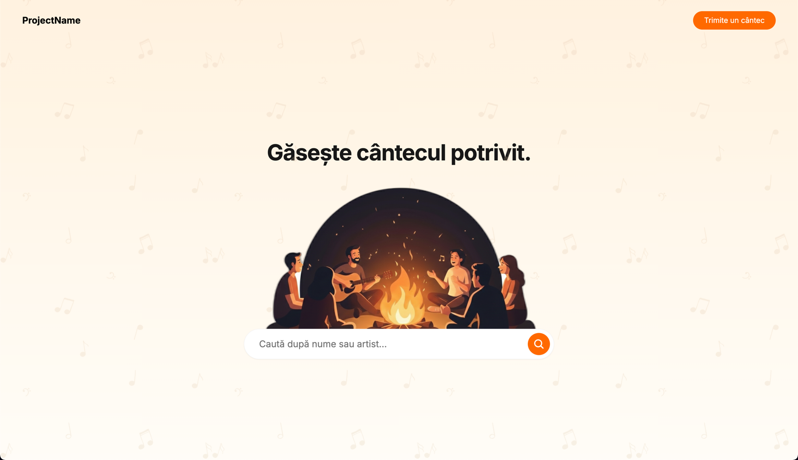

# Ziua 1: Landing Page

Construiește o pagină de destinație (landing page) cu o bară de căutare centrată care se suprapune peste o ilustrație cu
un foc de tabără.



---

## Configurare

Imaginile de care ai nevoie sunt deja în `app/static/`:

- `background-pattern.png`
- `campfire.png`

Le vei referenția folosind `../static/filename.png` deoarece fișierul tău HTML este în `templates/` și trebuie să urce
un nivel pentru a ajunge la `static/`.

[🤔 Ce înseamnă ../ în căile de fișiere?](https://claude.ai/new?q=%C3%8Env%C4%83%C8%9B%20dezvoltare%20web.%20Ce%20%C3%AEnseamn%C4%83%20..%2F%20%C3%AEntr-o%20cale%20de%20fi%C8%99ier%3F%20De%20ce%20a%C8%99%20folosi%20..%2Fstatic%2Fimage.png%20%C3%AEn%20loc%20de%20doar%20image.png%3F%20Explic%C4%83%20simplu.)

Creează acest fișier:

```

charms-of-david/
└── templates/
└── index.html

````

> **De ce index.html?** Este numele standard pentru fișierele paginii principale. Serverele web servesc automat
`index.html` atunci când cineva vizitează adresa URL rădăcină a site-ului tău.

---

## Pasul 1: Structura HTML de Bază

Creează `templates/index.html`:

```html
<!DOCTYPE html>
<html lang="ro">
<head>
    <meta charset="UTF-8">
    <meta name="viewport" content="width=device-width, initial-scale=1.0">
    <title>NumeProiect - Găsește cântecul potrivit</title>

</head>
<body>

</body>
</html>
````

Adaugă TailwindCSS folosind Play
CDN. [🤔 Ce este TailwindCSS?](https://www.google.com/search?q=https://claude.ai/new%3Fq%3D%25C3%258Imi%2520construiesc%2520primul%2520site.%2520Ce%2520este%2520TailwindCSS%2520%25C8%2599i%2520de%2520ce%2520l-a%25C8%2599%2520folosi%2520%25C3%25AEn%2520loc%2520s%25C4%2583%2520scriu%2520CSS%2520obi%25C8%2599nuit%253F%2520Explic%25C4%2583%2520simplu%2520pentru%2520un%2520%25C3%25AEncep%25C4%2583tor.)

Găsește eticheta script la [TailwindCSS Play CDN](https://tailwindcss.com/docs/installation/play-cdn) și lipește-o în
`<head>`.

-----

## Pasul 2: Adaugă Culori Personalizate

Tailwind include multe culori: `orange-50`, `orange-100`, `orange-200`, până la
`orange-950`. [Vezi toate culorile implicite](https://tailwindcss.com/docs/customizing-colors).

Designul nostru necesită două nuanțe suplimentare care nu sunt incluse implicit:

- `orange-25` (foarte deschis)
- `orange-75` (între 50 și 100)

Adaugă asta în `<head>` după scriptul TailwindCSS:

```html

<style type="text/tailwindcss">
    @theme {
        /* TODO: 1. Definește --color-orange-25 -> oklch(99.4% 0.008 73.263) */
        /* TODO: 2. Definește --color-orange-75 -> oklch(96.7% 0.029 74.022) */
    }
</style>
```

[🤔 Cum funcționează asta?](https://www.google.com/search?q=https://claude.ai/new%3Fq%3D%25C3%258En%2520TailwindCSS%2520v4%252C%2520cum%2520adaug%2520culori%2520personalizate%2520folosind%2520%2540theme%253F%2520Trebuie%2520s%25C4%2583%2520adaug%2520orange-25%2520%25C8%2599i%2520orange-75.%2520Arat%25C4%2583-mi%2520sintaxa%2520exact%25C4%2583%2520pentru%2520v4.)

Folosim oklch() pentru culori în loc de coduri hex (\#ff5500) sau
rgb(). [🤔 De ce oklch?](https://www.google.com/search?q=https://claude.ai/new%3Fq%3D%25C3%258En%2520dezvoltarea%2520web%252C%2520de%2520ce%2520este%2520oklch%2520mai%2520bun%2520dec%25C3%25A2t%2520codurile%2520hex%252C%2520RGB%2520sau%2520HSL%2520pentru%2520definirea%2520culorilor%253F%2520Explic%25C4%2583%2520pe%2520scurt%2520pentru%2520un%2520%25C3%25AEncep%25C4%2583tor.)

Odată adăugate, le poți folosi ca orice altă culoare Tailwind: `bg-orange-25`, `text-orange-75`, etc.

-----

## Pasul 3: Adaugă Fontul

Adaugă fontul Inter sub stilurile de culoare:

```html

<link href="[https://fonts.googleapis.com/css2?family=Inter:wght@400;600;700&display=swap](https://fonts.googleapis.com/css2?family=Inter:wght@400;600;700&display=swap)"
      rel="stylesheet">
<style>
    body {
        font-family: 'Inter', sans-serif;
    }
</style>
```

Aceasta încarcă fontul de la Google și îl setează ca implicit pentru pagina ta.

-----

## Pasul 4: Layout-ul Corpului (Body)

Ai nevoie de un fundal gradient (orange-75 care se estompează spre orange-25) cu o imagine model (pattern) suprapusă.

```html

<body class="...">

</body>
```

**Ce ai nevoie:**

Pentru `<body>`:

- Fundal cu gradient
  liniar. [🤔 Cum fac gradiente în v4?](https://www.google.com/search?q=https://claude.ai/new%3Fq%3D%25C3%258En%2520TailwindCSS%2520v4%252C%2520cum%2520creez%2520un%2520fundal%2520cu%2520gradient%2520liniar%2520de%2520sus%2520%25C3%25AEn%2520jos%253F%2520Vreau%2520s%25C4%2583%2520merg%2520de%2520la%2520orange-75%2520la%2520orange-25.%2520Care%2520este%2520sintaxa%2520exact%25C4%2583%2520a%2520clasei%2520v4%253F)
- Înălțime completă a
  ecranului. [🤔 Cum fac body-ul full height?](https://www.google.com/search?q=https://claude.ai/new%3Fq%3D%25C3%258En%2520TailwindCSS%2520v4%252C%2520ce%2520clas%25C4%2583%2520face%2520ca%2520elementul%2520body%2520s%25C4%2583%2520ocupe%2520toat%25C4%2583%2520%25C3%25AEn%25C4%2583l%25C8%259Bimea%2520ecranului%253F%2520D%25C4%2583-mi%2520numele%2520exact%2520al%2520clasei.)
- Layout flex
  column. [🤔 Ce este flex column?](https://www.google.com/search?q=https://claude.ai/new%3Fq%3D%25C3%258En%2520TailwindCSS%2520v4%252C%2520vreau%2520s%25C4%2583%2520a%25C8%2599ez%2520elementele%2520vertical%2520%25C3%25AEn%2520interiorul%2520body-ului.%2520Ce%2520clase%2520am%2520nevoie%2520pentru%2520un%2520layout%2520flexbox%2520column%253F%2520D%25C4%2583-mi%2520numele%2520exacte%2520ale%2520claselor%2520v4.)

Pentru imaginea model:

- Poziționare
  fixă. [🤔 Ce face poziționarea fixă?](https://www.google.com/search?q=https://claude.ai/new%3Fq%3D%25C3%258En%2520TailwindCSS%2520v4%252C%2520vreau%2520ca%2520o%2520imagine%2520de%2520fundal%2520s%25C4%2583%2520r%25C4%2583m%25C3%25A2n%25C4%2583%2520pe%2520loc%2520c%25C3%25A2nd%2520derulez.%2520Ce%2520clas%25C4%2583%2520face%2520un%2520element%2520fix%253F%2520%25C8%2599i%2520cum%2520o%2520fac%2520s%25C4%2583%2520acopere%2520%25C3%25AEntregul%2520ecran%2520cu%2520inset-0%253F%2520D%25C4%2583-mi%2520clasele%2520exacte%2520v4.)
- Mărime completă cu
  `size-full` [🤔 Ce este size-full?](https://www.google.com/search?q=https://claude.ai/new%3Fq%3D%25C3%258En%2520TailwindCSS%2520v4%252C%2520ce%2520face%2520clasa%2520size-full%253F%2520Cum%2520difer%25C4%2583%2520de%2520w-full%2520h-full%253F)
- Opacitate
  50%. [🤔 Cum schimb opacitatea?](https://www.google.com/search?q=https://claude.ai/new%3Fq%3D%25C3%258En%2520TailwindCSS%2520v4%252C%2520ce%2520clas%25C4%2583%2520seteaz%25C4%2583%2520opacitatea%2520unui%2520element%2520la%252050%2525%253F%2520D%25C4%2583-mi%2520numele%2520exact%2520al%2520clasei.)
- Acoperire
  container. [🤔 Cum fac imaginile să se potrivească?](https://www.google.com/search?q=https://claude.ai/new%3Fq%3D%25C3%258En%2520TailwindCSS%2520v4%252C%2520am%2520o%2520imagine%2520care%2520trebuie%2520s%25C4%2583-i%2520umple%2520complet%2520containerul.%2520Ce%2520clas%25C4%2583%2520face%2520ca%2520o%2520imagine%2520s%25C4%2583%2520acopere%2520containerul%253F%2520D%25C4%2583-mi%2520clasa%2520exact%25C4%2583%2520v4.)

**Test:** Deschide în browser. Ar trebui să vezi un gradient portocaliu cu o suprapunere subtilă a modelului.

-----

## Pasul 5: Bara de Navigare

Bara de navigare are două părți: numele site-ului în stânga, butonul în dreapta.

```html

<nav class="w-full px-6 py-6 md:px-12 flex justify-between items-center">
    <div class="...">
        NumeProiect
    </div>

    <button class="...">
        Trimite un cântec
    </button>
</nav>
```

**Ce ai nevoie:**

Pentru numele site-ului:

- Text
  mare. [🤔 Ce dimensiuni de text există?](https://www.google.com/search?q=https://claude.ai/new%3Fq%3D%25C3%258En%2520TailwindCSS%2520v4%252C%2520ce%2520clas%25C4%2583%2520face%2520textul%2520de%2520m%25C4%2583rime%2520xl%2520sau%25202xl%253F%2520Ce%2520alte%2520dimensiuni%2520de%2520text%2520sunt%2520disponibile%253F%2520Listeaz%25C4%2583%2520numele%2520exacte%2520ale%2520claselor%2520v4.)
- Text
  bold. [🤔 Cum fac textul bold?](https://www.google.com/search?q=https://claude.ai/new%3Fq%3D%25C3%258En%2520TailwindCSS%2520v4%252C%2520ce%2520clas%25C4%2583%2520face%2520textul%2520bold%2520%2528%25C3%25AEngro%25C8%2599at%2529%253F%2520D%25C4%2583-mi%2520numele%2520exact%2520al%2520clasei%2520v4.)
- Culoare
  neagră. [🤔 Cum colorez textul?](https://www.google.com/search?q=https://claude.ai/new%3Fq%3D%25C3%258En%2520TailwindCSS%2520v4%252C%2520ce%2520clas%25C4%2583%2520face%2520textul%2520negru%253F%2520D%25C4%2583-mi%2520numele%2520exact%2520al%2520clasei%2520v4.)

Pentru buton:

- Fundal
  portocaliu. [🤔 Cum colorez fundalurile?](https://www.google.com/search?q=https://claude.ai/new%3Fq%3D%25C3%258En%2520TailwindCSS%2520v4%252C%2520ce%2520clas%25C4%2583%2520ofer%25C4%2583%2520unui%2520element%2520un%2520fundal%2520portocaliu%253F%2520Vreau%2520orange-500.%2520D%25C4%2583-mi%2520clasa%2520exact%25C4%2583%2520v4.)
-

Padding. [🤔 Cum adaug padding?](https://www.google.com/search?q=https://claude.ai/new%3Fq%3D%25C3%258En%2520TailwindCSS%2520v4%252C%2520cum%2520adaug%2520padding%2520unui%2520buton%253F%2520Vreau%2520padding%2520st%25C3%25A2nga%252Fdreapta%2520%25C8%2599i%2520sus%252Fjos.%2520Arat%25C4%2583-mi%2520clasele%2520comune%2520de%2520padding%2520v4.)

- Colțuri
  rotunjite. [🤔 Cum rotunjesc colțurile?](https://www.google.com/search?q=https://claude.ai/new%3Fq%3D%25C3%258En%2520TailwindCSS%2520v4%252C%2520ce%2520clas%25C4%2583%2520face%2520un%2520buton%2520complet%2520rotunjit%2520%2528form%25C4%2583%2520de%2520pilul%25C4%2583%2529%253F%2520D%25C4%2583-mi%2520clasa%2520exact%25C4%2583%2520v4.)
- Text responsive cu
  breakpoint-uri. [🤔 Cum funcționează punctele de întrerupere responsive?](https://www.google.com/search?q=https://claude.ai/new%3Fq%3D%25C3%258En%2520TailwindCSS%2520v4%252C%2520explic%25C4%2583%2520prefixele%2520sm%253A%252C%2520md%253A%2520%25C8%2599i%2520lg%253A.%2520Cum%2520fac%2520textul%2520s%25C4%2583-%25C8%2599i%2520schimbe%2520m%25C4%2583rimea%2520la%2520l%25C4%2583%25C8%259Bimi%2520diferite%2520ale%2520ecranului%253F%2520D%25C4%2583%2520exemple%2520exacte%2520v4.)
- Grosime font
  medie. [🤔 Ce grosimi de font există?](https://www.google.com/search?q=https://claude.ai/new%3Fq%3D%25C3%258En%2520TailwindCSS%2520v4%252C%2520ce%2520clas%25C4%2583%2520face%2520textul%2520de%2520grosime%2520medie%2520%2528medium%2520weight%2529%253F%2520Ce%2520alte%2520grosimi%2520de%2520font%2520sunt%2520disponibile%253F)
- OPȚIONAL: Efect
  hover. [🤔 Cum funcționează stările hover?](https://www.google.com/search?q=https://claude.ai/new%3Fq%3D%25C3%258En%2520TailwindCSS%2520v4%252C%2520cum%2520adaug%2520un%2520efect%2520hover%2520pentru%2520a%2520schimba%2520culoarea%2520de%2520fundal%2520a%2520unui%2520buton%253F%2520Arat%25C4%2583-mi%2520un%2520exemplu%2520cu%2520prefixul%2520hover%253A.)

-----

## Pasul 6: Zona de Conținut Principal

Această secțiune ocupă tot spațiul rămas și își centrează conținutul.

```html

<main class="...">
</main>
```

**Ce ai nevoie:**

- Să crească pentru a umple
  spațiul. [🤔 Cum fac un element să umple spațiul rămas?](https://www.google.com/search?q=https://claude.ai/new%3Fq%3D%25C3%258En%2520TailwindCSS%2520v4%252C%2520am%2520un%2520container%2520flex%2520cu%2520o%2520bar%25C4%2583%2520de%2520navigare%2520%25C8%2599i%2520o%2520sec%25C8%259Biune%2520principal%25C4%2583.%2520Ce%2520clas%25C4%2583%2520face%2520ca%2520sec%25C8%259Biunea%2520principal%25C4%2583%2520s%25C4%2583%2520ocupe%2520tot%2520spa%25C8%259Biul%2520r%25C4%2583mas%253F%2520D%25C4%2583-mi%2520clasa%2520exact%25C4%2583%2520v4.)
- Să centreze
  conținutul. [🤔 Cum centrez conținutul?](https://www.google.com/search?q=https://claude.ai/new%3Fq%3D%25C3%258En%2520TailwindCSS%2520v4%252C%2520vreau%2520s%25C4%2583%2520centrez%2520con%25C8%259Binutul%2520at%25C3%25A2t%2520orizontal%2520c%25C3%25A2t%2520%25C8%2599i%2520vertical%2520%25C3%25AEn%2520interiorul%2520unui%2520container%2520flex.%2520Ce%2520clase%2520am%2520nevoie%253F%2520D%25C4%2583-mi%2520clasele%2520exacte%2520v4.)
- Spațiere
  responsive. [🤔 Cum fac spațierea responsive?](https://www.google.com/search?q=https://claude.ai/new%3Fq%3D%25C3%258En%2520TailwindCSS%2520v4%252C%2520cum%2520adaug%2520padding%2520care%2520se%2520schimb%25C4%2583%2520la%2520punctele%2520de%2520%25C3%25AEntrerupere%2520sm%253A%2520%25C8%2599i%2520md%253A%253F%2520%25C8%2599i%2520cum%2520adaug%2520margine%2520sus%2520doar%2520pe%2520mobil%253F%2520D%25C4%2583%2520clasele%2520exacte%2520v4.)

-----

## Pasul 7: Titlul Paginii

Adaugă asta ca prim element în interiorul `<main>`:

```html
<h1 class="...">
    Găsește cântecul potrivit.
</h1>
```

**Ce ai nevoie:**

- Mărimi de font
  responsive. [🤔 Cum schimb mărimea fontului în funcție de ecran?](https://www.google.com/search?q=https://claude.ai/new%3Fq%3D%25C3%258En%2520TailwindCSS%2520v4%252C%2520cum%2520fac%2520un%2520titlu%2520text-3xl%2520pe%2520mobil%252C%2520text-4xl%2520pe%2520sm%253A%2520%25C8%2599i%2520text-5xl%2520pe%2520md%253A%253F%2520D%25C4%2583%2520clasele%2520exacte%2520v4.)
- Centrare
  text. [🤔 Cum centrez textul?](https://www.google.com/search?q=https://claude.ai/new%3Fq%3D%25C3%258En%2520TailwindCSS%2520v4%252C%2520ce%2520clas%25C4%2583%2520centreaz%25C4%2583%2520textul%2520orizontal%253F%2520D%25C4%2583%2520clasa%2520exact%25C4%2583%2520v4.)
- Spațierea
  literelor. [🤔 Cum ajustez spațierea literelor?](https://www.google.com/search?q=https://claude.ai/new%3Fq%3D%25C3%258En%2520TailwindCSS%2520v4%252C%2520ce%2520clas%25C4%2583%2520face%2520literele%2520s%25C4%2583%2520stea%2520pu%25C8%259Bin%2520mai%2520aproape%2520unele%2520de%2520altele%2520pentru%2520un%2520aspect%2520mai%2520str%25C3%25A2ns%253F%2520D%25C4%2583-mi%2520clasa%2520exact%25C4%2583%2520v4.)
- Culori
  neutre. [🤔 Ce sunt culorile neutre?](https://www.google.com/search?q=https://claude.ai/new%3Fq%3D%25C3%258En%2520TailwindCSS%2520v4%252C%2520care%2520este%2520diferen%25C8%259Ba%2520dintre%2520gray-900%2520%25C8%2599i%2520neutral-900%253F%2520C%25C3%25A2nd%2520ar%2520trebui%2520s%25C4%2583-l%2520folosesc%2520pe%2520fiecare%253F)

-----

## Pasul 8: Container Imagine + Căutare

Bara de căutare se va suprapune peste imaginea focului de tabără folosind layere (straturi) și margine negativă.

```
[Imagine Foc de tabără] ← layer 10 (în spate)
[Bara de Căutare]       ← layer 20 (în față), trasă ÎN SUS
```

Adaugă asta după titlu în interiorul `<main>`:

```html

<div class="relative flex flex-col items-center w-full max-w-4xl">

    <div class="relative z-10 w-full flex justify-center">
        
    </div>

    <div class="...">
    </div>

</div>
```

**Ce ai nevoie:**

Pentru imaginea focului de tabără:

- Păstrarea
  proporțiilor. [🤔 Cum păstrez aspect ratio-ul imaginii?](https://www.google.com/search?q=https://claude.ai/new%3Fq%3D%25C3%258En%2520TailwindCSS%2520v4%252C%2520vreau%2520ca%2520o%2520imagine%2520s%25C4%2583-%25C8%2599i%2520p%25C4%2583streze%2520propor%25C8%259Biile%2520originale%2520c%25C3%25A2nd%2520este%2520redimensionat%25C4%2583.%2520Care%2520este%2520diferen%25C8%259Ba%2520dintre%2520object-contain%2520%25C8%2599i%2520object-cover%253F%2520D%25C4%2583%2520clasa%2520exact%25C4%2583%2520v4.)
- Lățime
  responsive. [🤔 Cum fac lățimea imaginii responsive?](https://www.google.com/search?q=https://claude.ai/new%3Fq%3D%25C3%258En%2520TailwindCSS%2520v4%252C%2520cum%2520fac%2520ca%2520o%2520imagine%2520s%25C4%2583%2520nu%2520aib%25C4%2583%2520limit%25C4%2583%2520de%2520l%25C4%2583%25C8%259Bime%2520pe%2520mobil%252C%2520dar%2520o%2520l%25C4%2583%25C8%259Bime%2520maxim%25C4%2583%2520specific%25C4%2583%2520pe%2520desktop%2520folosind%2520md%253Aw-3xl%253F)

Pentru containerul de căutare:

- Controlul
  layerelor. [🤔 Ce este z-index?](https://www.google.com/search?q=https://claude.ai/new%3Fq%3D%25C3%258En%2520TailwindCSS%2520v4%252C%2520vreau%2520ca%2520un%2520element%2520s%25C4%2583%2520apar%25C4%2583%2520deasupra%2520altuia.%2520Ce%2520este%2520z-index%2520%25C8%2599i%2520cum%2520%25C3%25AEl%2520folosesc%253F%2520Arat%25C4%2583-mi%2520clasele%2520z-10%2520%25C8%2599i%2520z-20%2520%25C3%25AEn%2520v4.)
- Lățime
  maximă. [🤔 Cum limitez lățimea elementului?](https://www.google.com/search?q=https://claude.ai/new%3Fq%3D%25C3%258En%2520TailwindCSS%2520v4%252C%2520ce%2520clas%25C4%2583%2520limiteaz%25C4%2583%2520l%25C4%2583%25C8%259Bimea%2520maxim%25C4%2583%2520a%2520unui%2520element%2520la%25202xl%253F%2520D%25C4%2583-mi%2520clasa%2520exact%25C4%2583%2520v4.)
- Margine
  negativă. [🤔 Cum funcționează marginea negativă?](https://www.google.com/search?q=https://claude.ai/new%3Fq%3D%25C3%258En%2520TailwindCSS%2520v4%252C%2520vreau%2520s%25C4%2583%2520trag%2520un%2520element%2520%25C3%258ZN%2520SUS%2520astfel%2520%25C3%25AEnc%25C3%25A2t%2520s%25C4%2583%2520se%2520suprapun%25C4%2583%2520cu%2520elementul%2520de%2520deasupra%2520lui.%2520Explic%25C4%2583%2520marginea%2520negativ%25C4%2583%2520%25C8%2599i%2520arat%25C4%2583-mi%2520cum%2520s%25C4%2583%2520folosesc%2520-mt-12%252C%2520sm%253A-mt-16%252C%2520lg%253A-mt-20%2520%25C3%25AEn%2520v4.)

-----

## Pasul 9: Bara de Căutare

Construiește o bară de căutare albă rotunjită cu un input și un buton. Aceasta vine în interiorul containerului de
căutare de la Pasul 8.

```html

<div class="...">
    <input type="text"
           placeholder="Caută după nume sau artist..."
           class="...">
    <button class="...">
        <svg xmlns="[http://www.w3.org/2000/svg](http://www.w3.org/2000/svg)" fill="none" viewBox="0 0 24 24"
             stroke-width="2.5" stroke="currentColor" class="w-6 h-6">
            <path stroke-linecap="round" stroke-linejoin="round"
                  d="M21 21l-5.197-5.197m0 0A7.5 7.5 0 105.196 5.196a7.5 7.5 0 0010.607 10.607z"/>
        </svg>
    </button>
</div>
```

**Ce ai nevoie:**

Pentru container:

- Adaugă
  umbră. [🤔 Cum adaug umbre?](https://www.google.com/search?q=https://claude.ai/new%3Fq%3D%25C3%258En%2520TailwindCSS%2520v4%252C%2520care%2520sunt%2520diferitele%2520clase%2520de%2520umbr%25C4%2583%253F%2520Care%2520este%2520diferen%25C8%259Ba%2520dintre%2520shadow-xs%252C%2520shadow-sm%2520%25C8%2599i%2520shadow-lg%253F)
- Adaugă
  chenar. [🤔 Cum adaug chenare?](https://www.google.com/search?q=https://claude.ai/new%3Fq%3D%25C3%258En%2520TailwindCSS%2520v4%252C%2520cum%2520adaug%2520un%2520chenar%2520subtil%2520cu%2520culoarea%2520neutral-100%253F%2520D%25C4%2583-mi%2520clasele%2520exacte%2520v4.)
- Spațierea
  elementelor. [🤔 Cum spațiez elementele flex?](https://www.google.com/search?q=https://claude.ai/new%3Fq%3D%25C3%258En%2520TailwindCSS%2520v4%252C%2520am%2520un%2520container%2520flex%2520cu%2520un%2520input%2520%25C8%2599i%2520un%2520buton.%2520Ce%2520clas%25C4%2583%2520pune%2520spa%25C8%259Biu%2520%25C3%25AEntre%2520ele%253F%2520D%25C4%2583-mi%2520clasa%2520exact%25C4%2583%2520v4.)
- Padding responsive cu proprietăți
  logice. [🤔 Ce sunt pl- și pe-?](https://www.google.com/search?q=https://claude.ai/new%3Fq%3D%25C3%258En%2520TailwindCSS%2520v4%252C%2520care%2520este%2520diferen%25C8%259Ba%2520dintre%2520pl-%252C%2520pr-%252C%2520ps-%2520%25C8%2599i%2520pe-%2520pentru%2520padding%253F%2520De%2520ce%2520s%25C4%2583%2520folosesc%2520propriet%25C4%2583%25C8%259Bi%2520logice%253F)

Pentru input:

- Umple
  spațiul. [🤔 Cum fac inputul să umple spațiul?](https://www.google.com/search?q=https://claude.ai/new%3Fq%3D%25C3%258En%2520TailwindCSS%2520v4%252C%2520am%2520un%2520container%2520flex%2520cu%2520un%2520input%2520%25C8%2599i%2520un%2520buton.%2520Ce%2520clas%25C4%2583%2520face%2520ca%2520inputul%2520s%25C4%2583%2520ocupe%2520tot%2520spa%25C8%259Biul%2520disponibil%253F%2520D%25C4%2583-mi%2520clasa%2520exact%25C4%2583%2520v4.)
- Elimină conturul la
  focus. [🤔 Cum elimin conturul inputului?](https://www.google.com/search?q=https://claude.ai/new%3Fq%3D%25C3%258En%2520TailwindCSS%2520v4%252C%2520c%25C3%25A2nd%2520dau%2520click%2520pe%2520un%2520c%25C3%25A2mp%2520input%252C%2520prime%25C8%2599te%2520un%2520contur%2520albastru.%2520Ce%2520clas%25C4%2583%2520%25C3%25AEl%2520elimin%25C4%2583%253F%2520D%25C4%2583-mi%2520clasa%2520exact%25C4%2583%2520v4.)
- Stilizează
  placeholder-ul. [🤔 Cum stilizez placeholder-ele?](https://www.google.com/search?q=https://claude.ai/new%3Fq%3D%25C3%258En%2520TailwindCSS%2520v4%252C%2520cum%2520fac%2520textul%2520placeholder%2520dintr-un%2520c%25C3%25A2mp%2520input%2520s%25C4%2583%2520fie%2520de%2520culoare%2520neutral-500%253F%2520D%25C4%2583-mi%2520clasa%2520exact%25C4%2583%2520v4.)

Pentru buton:

- Mărime
  fixă. [🤔 Cum setez lățime și înălțime fixă?](https://www.google.com/search?q=https://claude.ai/new%3Fq%3D%25C3%258En%2520TailwindCSS%2520v4%252C%2520vreau%2520ca%2520un%2520buton%2520s%25C4%2583%2520aib%25C4%2583%2520exact%252012%2520unit%25C4%2583%25C8%259Bi%2520l%25C4%2583%25C8%259Bime%2520%25C8%2599i%252012%2520unit%25C4%2583%25C8%259Bi%2520%25C3%25AEn%25C4%2583l%25C8%259Bime%2520%2528un%2520p%25C4%2583trat%2529.%2520Ce%2520clase%2520folosesc%253F%2520D%25C4%2583-mi%2520clasele%2520exacte%2520v4.)
- Centrează
  pictograma. [🤔 Cum centrez conținutul butonului?](https://www.google.com/search?q=https://claude.ai/new%3Fq%3D%25C3%258En%2520TailwindCSS%2520v4%252C%2520am%2520o%2520pictogram%25C4%2583%2520%25C3%25AEn%2520interiorul%2520unui%2520buton.%2520Ce%2520clase%2520centreaz%25C4%2583%2520pictograma%2520perfect%2520la%2520mijloc%253F%2520D%25C4%2583-mi%2520clasele%2520exacte%2520v4.)
- OPȚIONAL: Tranziții și
  hover. [🤔 Cum adaug tranziții netede?](https://www.google.com/search?q=https://claude.ai/new%3Fq%3D%25C3%258En%2520TailwindCSS%2520v4%252C%2520cum%2520adaug%2520tranzi%25C8%259Bii%2520netede%2520%2528smooth%2529%2520c%25C3%25A2nd%2520trec%2520cu%2520mouse-ul%2520peste%2520un%2520buton%253F%2520Arat%25C4%2583-mi%2520clasele%2520de%2520tranzi%25C8%259Bie%2520%25C8%2599i%2520efectele%2520hover.)

-----

## Testează-ți Munca

Deschide `index.html` în browser. Redimensionează fereastra de la mobil la desktop.

Verifică:

- ✓ Fundal gradient cu model
- ✓ Navigare cu logo și buton
- ✓ Titlu centrat
- ✓ Bara de căutare se suprapune peste focul de tabără
- ✓ Totul răspunde lin la diferite mărimi ale ecranului (în special la punctele de întrerupere small, medium și large)

Totul arată bine? Ai terminat\! 🎉

**Blocat?** Întreabă-l pe Claude: "Încerc să [ce vrei să faci] dar [ce se întâmplă]. Iată codul meu: [lipește codul]"
